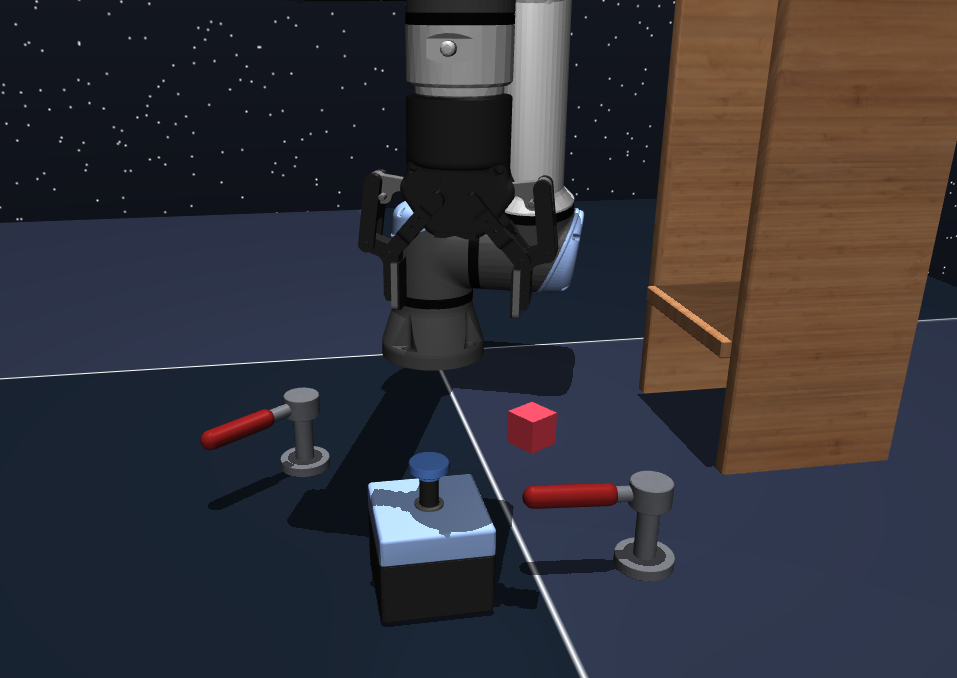
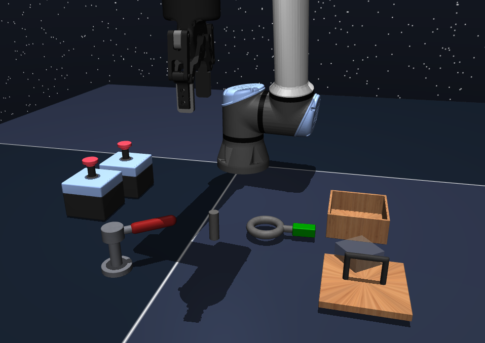
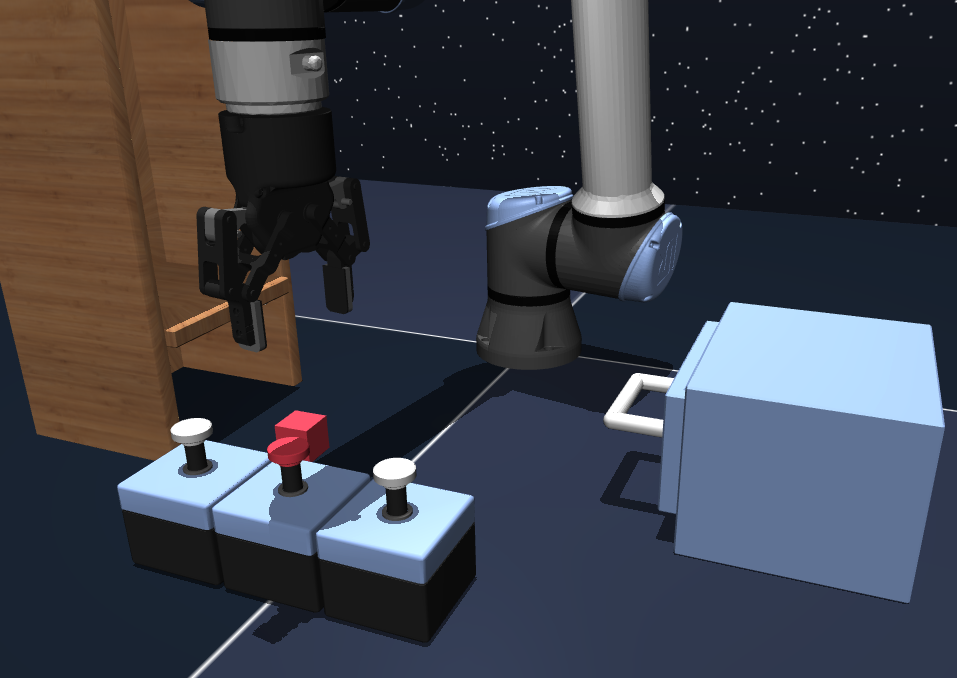
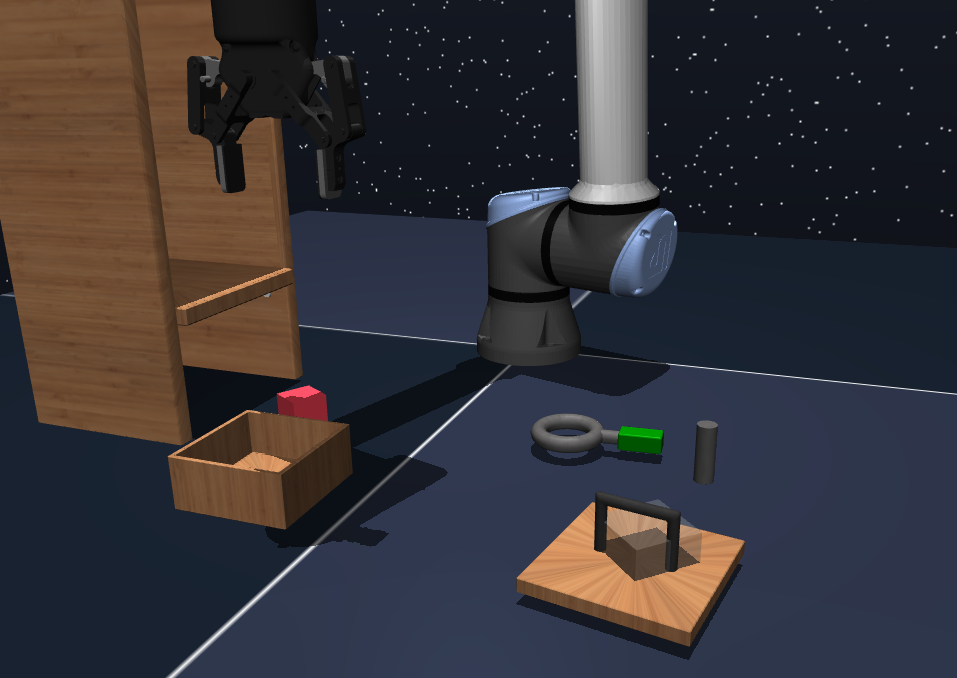
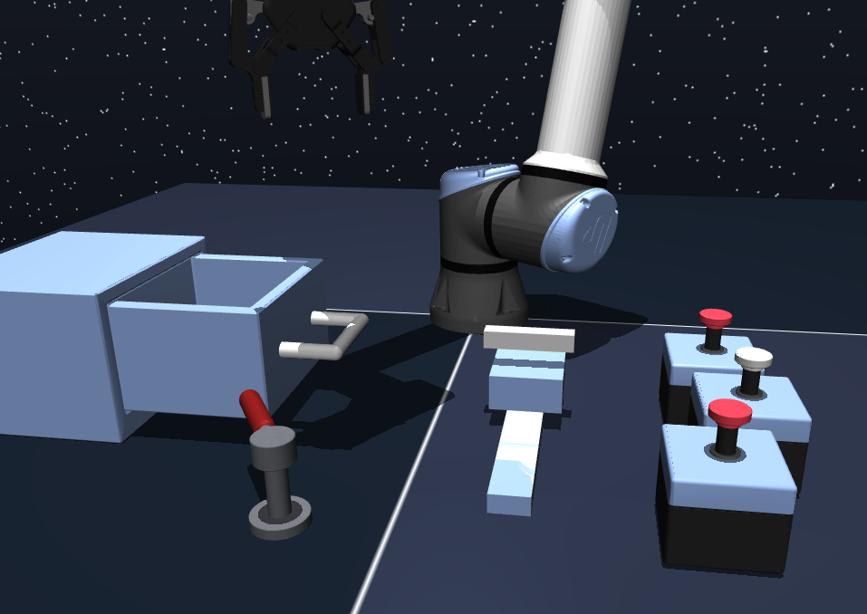
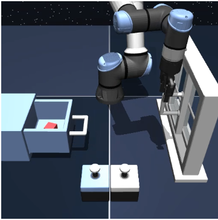

# Szenenbeschreibung

Dokumentation der Objekte und Kausalitäten für die
Szenen 1-5. (Standard OGBench Szene am Ende des Dokuments)

## Allgemein

- Buttons durchlaufen ihre Zustände zyklisch: **2-stufig** `0 -> 1 -> 0`,
  **3-stufig** `0 -> 1 -> 2 -> 0`.
- Passive Container (Shelf/Box) haben keine Interaktion; sie definieren nur, wo Objekte abgelegt werden können (Zielpositionen).
- Faucets (Revolute Joints) haben einen Min- und Max-Wert; die Ausgangsposition ist zufällig, die Zielposition ist immer der Min- oder Max-Wert.
- Buttons haben States, die durch Drücken zyklisch durchlaufen werden. Ausgangsposition und Ziel sind zufällig.
- Window, Slider und Drawer (Prismatic Joints) haben ebenfalls einen Min- und Max-Wert und funktionieren wie der Faucet.
- Cube, Peg und Lid werden in einem festgelegten Bereich zufällig platziert. Die Zielposition ist ebenfalls zufällig in diesem Bereich.
- Der Cube kann zusätzlich die Zielbereiche Shelf, Drawer und Box haben.
- Der Lid (Deckel) kann auf der Box platziert werden.
- Der Peg verlangt, dass ein Ring auf ihm platziert wird (Ziel).
- Shelf und Box sind statische Objekte, die nur als Zielbereiche für den Cube dienen.

## Scene1

#### Objekte

- `button0` (3-stufig): immer drückbar.
- `faucet0` (min −1.3 rad, max 1.3 rad): gesperrt solange `button0 == 1`.
- `faucet1` (min −1.57 rad, max 1.57 rad): gesperrt solange `faucet0 == 1.3`
  **und** `button0 == 2`.
- `cube0`: frei; kann auf `shelf0` abgelegt werden.
- `shelf0`: passiver Container.

#### Tapas (9 TPGMMs)

- faucet0_a_b (von Seite A nach Seite B)
- faucet0_b_a
- faucet1_a_b
- faucet1_b_a
- cube0_base_base (von Pos. A nach Pos. B auf dem Boden)
- button0_s2_s0 (von State 2 nach State 0)
- button0_s0_s1
- button0_s1_s2
- cube0_base_shelf0

## Scene2

#### Objekte

- `button0` (3-stufig): immer drückbar.
- `button1`: gesperrt solange `button0 == 2`.
- `faucet0` (min −1.45 rad, max 1.0 rad): gesperrt solange `button0 == 0`
  **und** `button1 == 1`.
- `peg0`
- `lid0`: kann auf `box0` abgelegt werden.
- `box0`: passiver Container.

#### Tapas (10 TPGMMs)

- faucet0_b_a
- button0_s1_s2
- peg0_base_base
- button1_s1_s0
- lid0_base_base
- faucet0_a_b
- lid0_base_box0
- button0_s0_s1
- button1_s0_s1
- button0_s2_s0

## Scene3

#### Objekte

- `button0`: gesperrt solange `button1 == 1`.
- `button1`: immer drückbar.
- `button2`: gesperrt solange `button0 == 0`.
- `drawer0`: gesperrt solange `button0 == 1`.
- `cube0`: kann auf `shelf0` oder in `drawer0` abgelegt werden.
- `shelf0`: passiver Container.

#### Tapas (11 TPGMMs)

- button0_s1_s0
- button0_s0_s1
- button2_s1_s0
- button2_s0_s1
- button1_s0_s1
- button1_s1_s0
- cube0_base_base
- cube0_base_shelf0
- drawer0_b_a
- drawer0_a_b
- cube0_base_drawer0

## Scene4

#### Objekte

- Keine Buttons, **keine Sperren** – alle Objekte frei beweglich.
- `cube0`: kann auf `shelf0` oder in `box0` abgelegt werden (Container).
- `lid0`: kann auf `box0` abgelegt werden.
- `peg0`
- `box0`/`shelf0`: passive Container.

#### Tapas (6 TPGMMs)

- peg0_base_base
- lid0_base_base
- cube0_base_base
- cube0_base_shelf0
- cube0_base_box0
- lid0_base_box0

## Scene5

#### Objekte

- `button0`: gesperrt solange `button1 == 2`.
- `button1` (3-stufig): immer drückbar.
- `button2`: gesperrt solange `button0 == 0`.
- `drawer0`: gesperrt solange `button0 == 0` **und** `button1 == 2`.
- `slider0`
- `faucet0` (min −1.57 rad, max 1.57 rad)

#### Tapas (13 TPGMMs)

- slider0_a_b
- faucet0_b_a
- button0_s0_s1
- button2_s1_s0
- button2_s0_s1
- slider0_b_a
- button1_s0_s1
- faucet0_a_b
- drawer0_a_b
- drawer0_b_a
- button1_s2_s0
- button1_s1_s2
- button0_s1_s0

## OGScene Evaluations Environment (als Referenz)

#### Objekte

- `button0` (2-stufig): immer drückbar.
- `button1` (2-stufig): immer drückbar
- `cube0`: frei; kann in `drawer0` abgelegt werden.
- `drawer0`: gesperrt solange `button0 == 1`.
- `window0`: gesperrt solange `button1 == 1`.

#### Tapas (8 TPGMMs)

- window0_a_b
- window0_b_a
- button0_s0_s1
- button0_s1_s0
- button1_s0_s1
- button1_s1_s0
- cube0_base_drawer0
- cube0_base_base
  
